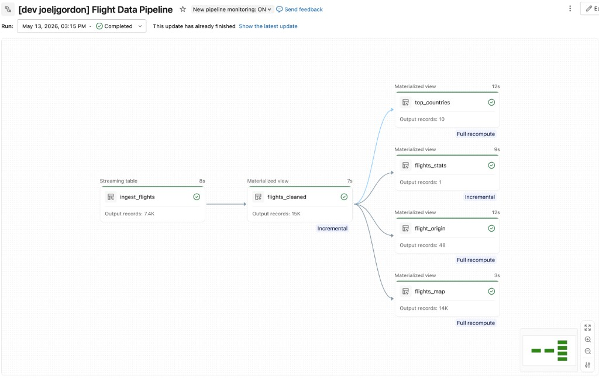
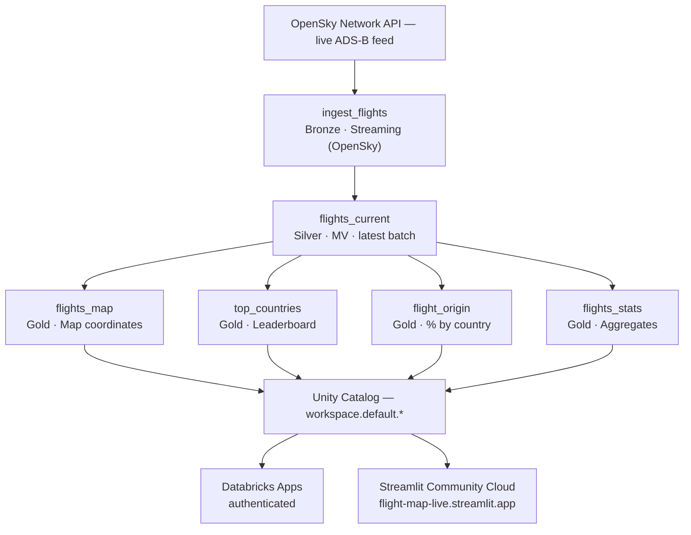

# Flight Data Pipeline

A production-grade, end-to-end data engineering pipeline on Databricks — real-time global flight tracking from ingestion to interactive visualisation.

[](https://flight-map-live.streamlit.app)

---

## Pipeline in action



*Live pipeline run in Databricks — each run fetches one OpenSky snapshot into bronze/silver; gold reads **`flights_current`** (no separate `flights_cleaned` table).*

---

## What this demonstrates

- **Real-time ingestion** — live ADS-B state vectors from the [OpenSky Network](https://opensky-network.org/) REST API
- **Declarative pipelines** — Lakeflow Spark Declarative Pipelines (DLT) with snapshot materialised views and gold aggregates
- **Unity Catalog** — three-part naming, data governance, and lineage across dev/prod
- **Infrastructure as code** — Databricks Asset Bundles (`databricks.yml`) for reproducible, CI/CD-ready deploys
- **Environment separation** — `dev` deploys to personal workspace path; `prod` deploys to `/Workspace/Shared/`
- **Serverless compute** — no manual cluster management throughout
- **Full-stack app** — Streamlit app deployed to both Databricks Apps (authenticated) and Streamlit Community Cloud (public)

---

## Architecture



---

## Repo layout

```
databricks/
├── pipelines/
│   └── transformations/       # DLT pipeline — one file per table (+ shared transforms)
│       ├── flight_row_transforms.py
│       ├── ingest_flights.py
│       ├── flights_current.py
│       ├── flights_map.py
│       ├── top_countries.py
│       ├── flight_origin.py
│       └── flight_stats.py
├── apps/
│   └── flight_map/            # Streamlit app
│       ├── app.py
│       ├── app.yaml
│       └── requirements.txt
├── notebooks/                 # Exploratory / observability notebooks
├── resources/                 # DABs resource definitions (jobs, pipelines, app)
│   ├── flight_data_pipeline.yml
│   ├── flight_refresh_job.yml
│   ├── flight_explorer_job.yml
│   └── flight_map_app.yml
├── src/                       # Shared Python modules (importable)
├── tests/
│   ├── unit/                  # Local unit tests (no cluster required)
│   └── integration/           # Integration tests (require live cluster)
├── docs/
│   └── screenshots/           # Workspace screenshots for README
├── scripts/                   # Local CLI helpers
├── .env.example               # Required environment variables (template)
├── .streamlit/
│   └── secrets.toml.example   # Streamlit Cloud secrets template
├── databricks.yml             # Bundle root — targets dev + prod
└── Makefile                   # Developer workflow shortcuts
```

---

## Getting started

### Prerequisites

- [Databricks CLI](https://docs.databricks.com/dev-tools/cli/index.html) >= v0.292.0
- A Databricks workspace with Unity Catalog enabled
- Python 3.11+
- A Java runtime on PATH (for `tests/unit` PySpark checks; contract-only tests still run without it)

### 1. Authenticate

```bash
databricks auth login --host https://<your-workspace>.cloud.databricks.com
```

### 2. Configure

Copy `.env.example` to `.env` and fill in your values:

```bash
cp .env.example .env
```

Update `databricks.yml` with your workspace host.

### 3. Deploy to dev

```bash
make deploy-dev
```

This uploads all pipeline, notebook, and app files to your personal dev path and provisions all resources (pipeline, jobs, app).

### 4. Run the pipeline

```bash
make pipeline-start
```

### 5. Open the app

```bash
# After deploy, the app URL is printed — or find it with:
databricks apps list --profile DEFAULT
```

### Unit tests

Two groups (see `pyproject.toml` markers):

| Marker | What it checks | Needs JVM? |
|--------|----------------|------------|
| `@contract` | Gold reads `flights_current` only; `flights_cleaned` absent from repo and bundle YAML. | No |
| `@spark` | `flight_row_transforms.transform_bronze_to_silver_shape` on local PySpark. | Yes |

Default pytest options include **`-rs`** so skip reasons appear even with **`-q`**. You still get a short **interpretation block** at the end when `@spark` tests are skipped.

```bash
make test-unit              # verbose test names + skips + end summary
make test-unit-contract     # only @contract (five checks, no PySpark)
uv run --extra dev pytest tests/unit -m spark -v   # only transform tests (after fixing Java)
```

`pytest tests/unit -q` stays quiet on individual passes but still prints **SKIP** lines and the **summary section** from `-rs` and `pytest_terminal_summary`.

---

## Troubleshooting (pipelines)

### `CANNOT_CHANGE_DATASET_TYPE` on `flights_current`

The OpenSky Python source only supports **`readStream`** (batch `spark.read` fails with `reader is not implemented`). Bronze stays a **streaming table**; silver is a **materialized view** of the **latest `time_ingest` batch** only.

If `flights_current` was previously a streaming table, drop it and its pipeline materialization, then full-refresh:

```sql
DROP TABLE IF EXISTS workspace.default.flights_current;
DROP TABLE IF EXISTS workspace.default.__materialization_mat_<pipeline-id>_flights_current_1;
```

Replace `<pipeline-id>` with underscores instead of hyphens (see `SHOW TABLES IN workspace.default LIKE '__materialization%flights_current%'`).

```bash
make deploy-dev
make pipeline-full-refresh-dev
```

Full refresh alone does **not** change `STREAMING_TABLE` → `MATERIALIZED_VIEW`. See [Full refresh](https://docs.databricks.com/en/ldp/full-refresh-st.html).

**Reliable way from this repo (CLI):**

```bash
make pipeline-stop                  # optional: clear an in-flight update
make pipeline-full-refresh-dev      # bundle run with --full-refresh-all
```

(`databricks bundle validate` JSON does **not** include pipeline ids; use `bundle run … --full-refresh-all`, not `pipelines start-update` + parsed id.)

**If the UI “full refresh” fails or does nothing useful**

- The scheduled job in `resources/flight_refresh_job.yml` uses **`full_refresh: false`**, so **job-triggered** runs are always incremental. Use **`make pipeline-full-refresh-dev`** or the workspace **Pipelines** UI to start an update with full refresh, not only the job.
- Ensure no **other update** is already running on the same pipeline.
- If the error is about **downstream** datasets or **source replay**, copy the **exact** failure message from the pipeline event log; full refresh can still fail if the OpenSky stream cannot be replayed from an empty checkpoint or if there is a platform-specific constraint.

After checkpoints match the new plan, return to normal incremental updates (`make pipeline-start`).

---

## Makefile reference

| Command | What it does |
|---------|-------------|
| `make validate` | Validate `databricks.yml` and all resource definitions |
| `make deploy-dev` | Deploy bundle to dev (personal workspace path) |
| `make deploy-prod` | Deploy bundle to prod (`/Workspace/Shared/`) |
| `make pipeline-start` | Trigger a pipeline refresh run (incremental) |
| `make pipeline-full-refresh-dev` | Full refresh dev (`bundle run` + `--full-refresh-all`) |
| `make pipeline-full-refresh-prod` | Full refresh prod |
| `make pipeline-stop` | Stop dev pipeline (bundle key + `-t dev`) |
| `make pipeline-stop-prod` | Stop prod pipeline |
| `make sync-pipeline` | Hot-reload pipeline files to workspace (watch mode) |
| `make sync-notebooks` | Hot-reload notebooks to workspace (watch mode) |
| `make test-unit` | Run `pytest tests/unit -v` (markers + skip reasons) |
| `make test-unit-contract` | Only `@contract` unit tests (no JVM) |

## Running the Streamlit app locally

```bash
cd apps/flight_map
pip install -r requirements.txt
streamlit run app.py
```

Requires `DATABRICKS_HOST`, `STREAMLIT_CLOUD_READONLY_TOKEN`, and `DATABRICKS_WAREHOUSE_ID` in your `.env`. See `.env.example` and `.streamlit/secrets.toml.example`.

---

## Environment separation

| Target | Workspace path | Unity Catalog |
|--------|---------------|---------------|
| `dev` | `~/flight-data-pipeline/dev` | `workspace.default.*` |
| `prod` | `/Workspace/Shared/flight-data-pipeline/prod` | `main.default.*` |
